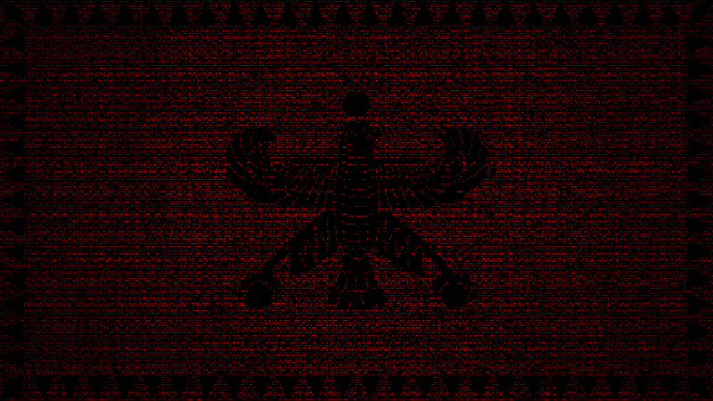

  

*Dorood.* I'm Kourosh (𐎠𐎥𐎥𐎠𐎥), an ML Master's student at the [University of Tübingen](https://uni-tuebingen.de/en/study/finding-a-course/degree-programs-available/detail/course/machine-learning-master/) and an ML Engineer at [Heimat Software GmbH](https://heimat-software.com/). 

Co-founded the first [AI Club](https://kaisabanci.com/) at Sabancı University. Co-authored a paper accepted at [ICML 2024](https://icml.cc/virtual/2024/39024) with Yale University. Former data scientist at [Buluttan](https://www.buluttan.com/) (renewable energy forecasting, Istanbul).

You can find out more about me via:
[Website](https://kouroshksh.github.io) · [GitHub](https://github.com/KouroshKSH) · [LinkedIn](https://linkedin.com/in/kouroshsharifi) · [Medium](https://medium.com/@kourosh.sharifi) · [Google Scholar](https://scholar.google.com/citations?user=JKDX3nwAAAAJ&hl=en) · [Linktree](https://linktr.ee/kourosh.sharifi)
